# Maze Engine (High-Performance Python Maze System)

**Maze Engine** is a state-of-the-art maze generation and solving system engineered in Python. It proves that Python can handle massive procedural generation tasks (up to **400 Million Cells**) given the right data structures and GPU acceleration.

> **Performance**: Generates a 5,000 x 5,000 maze (25M cells) in seconds. Solves it in real-time using GPU-accelerated visualization.

## 📋 Table of Contents
1.  [Key Features](#-key-features)
2.  [Installation](#-installation)
3.  [Testing](#-testing)
4.  [Command Reference Manual](#-command-reference-manual)
5.  [Difficulty Presets](#-difficulty-presets)
6.  [Benchmark Results](#-benchmark-results-perfect-maze)
7.  [File Format & Efficiency](#-file-format--efficiency)
8.  [Algorithm Logic & Theory](#-algorithm-logic--theory)
9.  [Project Structure](#-project-structure)
10. [Controls](#-controls-visual-mode)

## 🚀 Key Features

### 1. Massive Scale Support
- **Bit-Packed Grid**: Uses `bytearray` to store 8 flags per cell per byte.
- **Memory Efficient**: A 20k x 20k maze (400M cells) requires only ~400MB RAM.
- **GPU Rendering**: Custom **Taichi** kernel renders millions of cells.


### 2. The Four Generators
We support four distinct generation archetypes, ensuring variety for every use case:

| CLI Name | Type | Description | Hardware | Best For... |
| :--- | :--- | :--- | :--- | :--- |
| **`organic`** | Coral / Dust | **Parallel Hunt & Kill**. Seamless, high branching factor, "fuzzy" texture. | **GPU** | Natural cave-like structures. |
| **`fractal`** | Block / Grid | **Hierarchical DFS**. Distinct "Macro-Maze" structure made of sub-blocks. Very complex dead-ends. | **GPU** | Visualizing hierarchical recursion. |
| **`dfs`** | River / Snake | **Recursive Backtracker**. Long, winding single paths ("Rivers"). The hardest to solve. | **CPU** | "Pure" maze theory enthusiasts. |
| **`prim`** | Branching | **Prim's Algorithm**. Short, predictable branching. | **CPU** | Standard, balanced mazes. |

### 3. Advanced Solvers (The Race)
We implement 10+ algorithms to demonstrate conflicting solving strategies.

**Visual Showcase (2000x2000 Solves):**

| | | |
| :---: | :---: | :---: |
| **BFS (The Flood)**<br>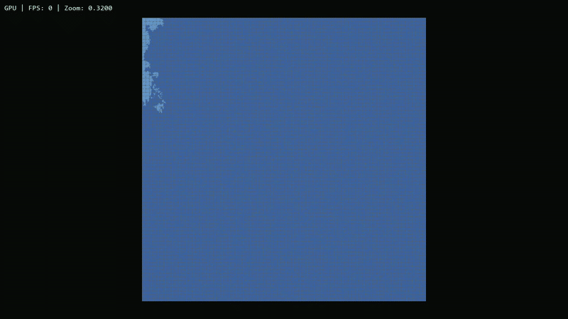 | **A-Star (The Beam)**<br>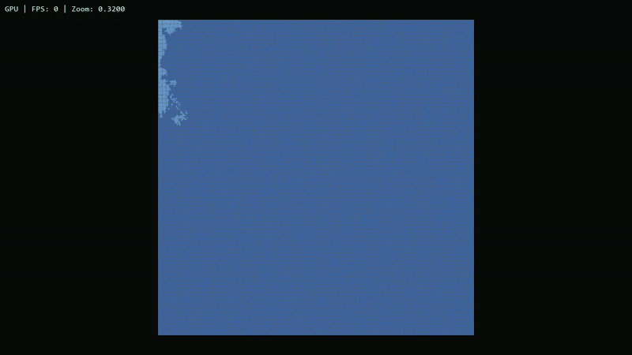 | **Bi-Directional A* (The Hug)**<br>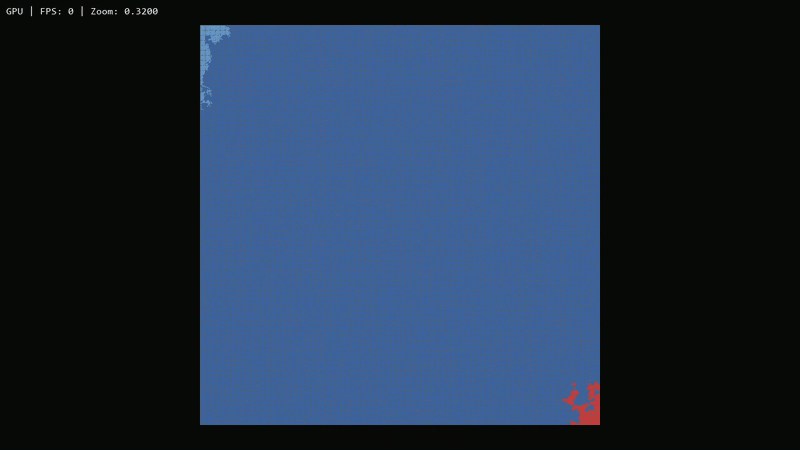 |
| **Swarm (The Hive)**<br>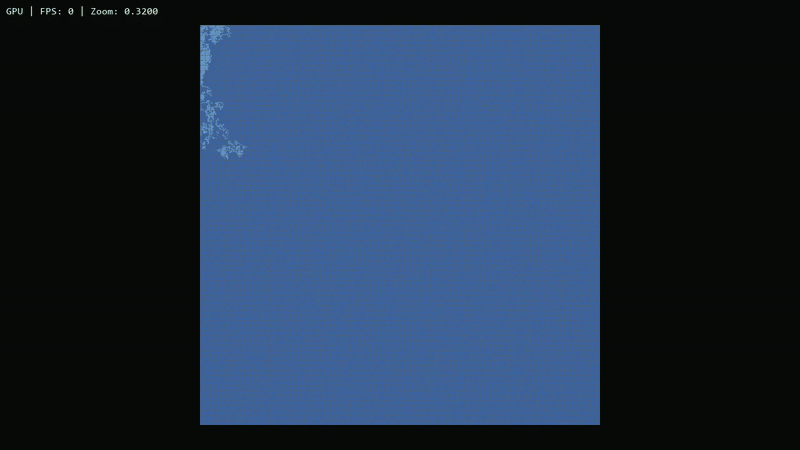 | **Right Wall Follower**<br>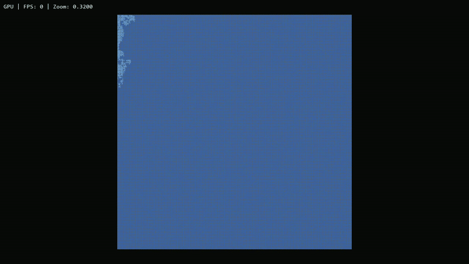 | **Left Wall Follower**<br>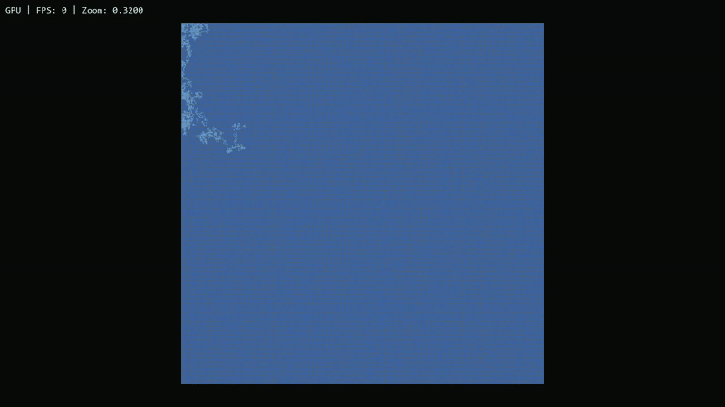 |

| Algorithm | Mechanism & Behavior | Computational Theory |
| :--- | :--- | :--- |
| **`bfs`** | **Breadth-First Search**. Explores the maze layer-by-layer, expanding equally in all directions like a ripple. It uses a **FIFO Queue** to visit every neighbor at depth `d` before `d+1`. | **Optimal**. Guaranteed to find the shortest path. $O(V+E)$. |
| **`dijkstra`** | **Weighted Search**. Uses a **Priority Queue** to explore the "lowest cost" path first. On a standard maze, it behaves identically to BFS but is designed for weighted graphs (e.g., mud or difficult terrain). | **Optimal**. Base for A*. |
| **`astar`** | **Heuristic Search**. Uses a "Guess" (Heuristic) to prioritize nodes. It calculates `Cost + Manhattan_Distance` to the exit. It aims straight for the target, ignoring side paths unless blocked. | **Fast**. Optimal if heuristic is admissible. |
| **`biastar`** | **Bidirectional A***. Runs two simultaneous A* searches: one from Start, one from Exit. They expand towards each other and connect in the middle. This often cuts the search area by 50% or more. | **Scalable**. Best for massive mazes. |
| **`dfs_solve`** | **Depth-First Search**. Uses a **LIFO Stack**. It rushes down a single path until it hits a wall, then backtracks. It produces a "snaky", unoptimized solution path but is very memory efficient. | **Sub-Optimal**. Solutions are long and winding. |
| **`left`** | **Wall Follower**. A purely local rule: "Keep your left hand on the wall". It requires **Zero Memory** of the maze structure. | **Fragile**. Fails in **Braided** mazes (loops). |
| **`deadend`** | **Topology Reduction**. Instead of searching, it creates a cellular automaton that iteratively "fills in" any cell with 3 walls (a dead end). It repeats this until only the solution path (non-dead ends) remains. | **Unique**. Solves the whole map at once. |
| **`tremaux`** | **Path Marking**. The robot marks paths it walks with a "pheromone". 1 Mark = Visited. 2 Marks = Visited Twice (Invalid). It treats the maze as a graph and logically deduces loops without seeing the whole map. | **Robust**. Solves loops with $O(1)$ view. |

---

## 🛠️ Installation

### Prerequisites
*   **Python**: Version **3.10** or higher is recommended.
*   **GPU Drivers** (Optional): For high-performance rendering (Taichi), ensure your NVIDIA/AMD drivers are up to date.

### Fast Setup
We recommend using a virtual environment to keep dependencies clean.

```bash
# 1. Clone the repository
git clone https://github.com/Jason-Hoford/maze-engine.git
cd maze-engine

# 2. Create Virtual Environment (Optional but Recommended)
python -m venv venv
# Windows:
.\venv\Scripts\activate
# Mac/Linux:
source venv/bin/activate

# 3. Install Dependencies
pip install -r requirements.txt
```

## 🧪 Testing

The engine ships with a robust test suite powered by `pytest`.

```bash
# Run the full test suite
pytest tests/
```

**Coverage:**
*   **✅ Core Logic**: Verifies bit-level operations and strict maze definitions (Perfect Maze properties).
*   **✅ Algorithms**: Validates that Solvers find correct paths and Generators produce solvable mazes.
*   **✅ GPU Integration**: Auto-detects available hardware and verifies the Taichi compute pipeline.
*   **✅ IO System**: Tests compression, serialization, and metadata integrity.

---

## 📖 Command Reference Manual

The engine is controlled via `maze_engine/main.py`. The general syntax is:
`python maze_engine/main.py [COMMAND] [FLAGS]`

### 1. Command: `generate`
Creates a new maze.

**Essential Flags:**
- `--width [int]`, `--height [int]`: Dimensions of the maze. Default: 100x100.
- `--algo [str]`: The algorithm to use (`dfs`, `prim`, `fractal`, `organic`).
- `--out [file]`: Path to save the maze file (e.g., `my_maze.maze`). **Highly Recommended** so you can solve it later.
- `--headless`: Run silently without opening a window (Faster).

**Optional Flags:**
- `--visual`: Show the generation process in a window.
- `--gpu`: Use Taichi GPU renderer (Recommended for `--visual` on large grids).
- `--seed [int]`: Random seed for reproducibility.
- `--braid [0.0-1.0]`: Dead-end removal factor. `0.0` = Perfect Tree. `1.0` = Open Grid (No dead ends).
- `--record-events [file]`: Save binary event log for later replay.

**Examples:**
```bash
# Generate a massive 5000x5000 Organic maze on GPU
python maze_engine/main.py generate --width 5000 --height 5000 --algo organic --out universe.maze --headless

# Generate a visual Fractal maze
python maze_engine/main.py generate --width 500 --height 500 --algo dfs --visual --gpu

# Record the "Organic" generation process to MP4
python maze_engine/main.py generate --width 500 --height 500 --algo dfs --record --gpu
```

### 🆕 Recording Generation (The 4 Flavors)
You can visually record the creation process of any algorithm. Videos are saved to `recordings/`.

**1. Organic (Coral)**
```bash
python maze_engine/main.py generate --width 500 --height 500 --algo organic --record --gpu
```
**2. Fractal (Blocks)**
```bash
python maze_engine/main.py generate --width 500 --height 500 --algo fractal --record --gpu
```
**3. DFS (Rivers - CPU)**
```bash
python maze_engine/main.py generate --width 200 --height 200 --algo dfs --record
```
**4. Prim (Branches - CPU)**
```bash
python maze_engine/main.py generate --width 200 --height 200 --algo prim --record
```

### 2. Command: `solve`
Solves an existing maze file.

**Essential Flags:**
- `input_file`: The `.maze` file generated previously.
- `--algo [str]`: The solver to use (`bfs`, `astar`, `biastar`, `tremaux`, `deadend`, etc.).

**Visualization Flags (Recommended):**
- `--visual`: Open the window to watch the solver.
- `--gpu`: **Always use this** for large mazes. Uses GPU rendering for 60FPS performance.
- `--record`: Automatically save an MP4 recording of the solution.

**Examples:**
```bash
# Solve with Bi-Directional A* (Fastest) and Watch
python maze_engine/main.py solve universe.maze --algo biastar --visual --gpu

# Record a Wall Follower solution
python maze_engine/main.py solve universe.maze --algo left --record --gpu
```

### 3. Command: `replay`
Replays a recorded binary event log. This is useful for "Time Travel" debugging or high-quality rendering of headless runs.

**Arguments:**
- `event_file`: The `.events` file saved during generation/solving.
- `--maze [file]`: The base `.maze` file (Required to see walls, otherwise only the path is shown).
- `--gpu`: Use GPU renderer.
- `--record`: Save to MP4.

**Example:**
```bash
python maze_engine/main.py replay my_run.events --maze my_maze.maze --gpu --record
```

### 4. Command: `benchmark`
Runs a scientific performance analysis suite.

**Arguments:**
- `--size [int]`: The side length of the square maze to benchmark. Default: 4600.

**Example:**
```bash
python maze_engine/main.py benchmark --size 2000
```

---

## 🧠 Difficulty Presets

**🟢 Level 1: "The Walk in the Park"**
Open loops, organic structure. Hard to get truly stuck.
```bash
python maze_engine/main.py generate --width 50 --height 50 --algo prim --braid 0.8 --visual
```

**🟡 Level 2: "The Standard Challenge"**
Classic perfect maze. Long corridors.
```bash
python maze_engine/main.py generate --width 100 --height 100 --algo dfs --braid 0.0 --visual
```

**🔴 Level 3: "The Labyrinth"**
Massive scale, no loops. A test of endurance.
```bash
python maze_engine/main.py generate --width 500 --height 500 --algo dfs --braid 0.0 --visual
```

**💀 Level 4: "The Nightmare" (Fractal)**
A "Maze of Mazes". Huge dead-end regions trap solvers for thousands of steps.
```bash
python maze_engine/main.py generate --width 2000 --height 2000 --algo fractal --out nightmare.maze --headless
python maze_engine/main.py solve nightmare.maze --algo astar --visual --gpu
```

**⚡ Level 5: "The Universe" (Multi-GPU Scale)**
Generate 20,000 x 20,000 (400 Million Cells).
```bash
python maze_engine/main.py generate --width 20000 --height 20000 --algo organic --out universe.maze
```
*Warn: This requires ~400MB VRAM.*

## 📊 Benchmark Results (Perfect Maze)

**Test System Specifications:**
*   **OS**: Windows 11
*   **CPU**: AMD Ryzen 9 6900HS Creator Edition (8 Cores)
*   **GPU**: NVIDIA GeForce RTX 3050 Laptop GPU
*   **RAM**: ~28GB Available (32GB Total)

We ran the solvers against "Perfect Mazes" (Braid 0.0, Single Solution).
> **Note**: `TREMAUX` is marked as **Failed** (Last Place) because it returned Path length 0, indicating it could not solve these perfect mazes correctly without loops to exploit.
> **Note**: For sizes > 7000x7000, we switch to `TaichiGenAdapter` for generation, maintaining Max Difficulty.

#### Small Scale (500x500)
| Rank | Algorithm | Time (s) | Path | Visited | Status |
| :--- | :--- | :--- | :--- | :--- | :--- |
| 1 | **DFS_SOLVE** | 0.35s | 48,837 | 108,947 | ✅ Sub-Optimal |
| 2 | **RIGHT** | 0.52s | 228,193 | 138,515 | ✅ Slow |
| 3 | **LEFT** | 0.66s | 271,801 | 160,319 | ✅ Slow |
| 4 | **BFS** | 0.75s | 48,837 | 203,654 | 🏆 Optimal |
| 5 | **DEADEND** | 0.90s | 48,837 | 201,163 | ✅ Unique |
| 6 | **DIJKSTRA** | 0.95s | 48,837 | 203,674 | 🏆 Optimal |
| 7 | **ASTAR** | 1.01s | 48,837 | 201,617 | 🏆 Optimal |
| 8 | **SWARM** | 1.02s | 48,836 | 156,186 | ✅ Good |
| 9 | **BIASTAR** | 1.27s | 48,837 | 231,884 | ✅ Scalable |
| 10 | **TREMAUX** | 0.05s | 0 | 6,381 | ❌ **FAILED** |

#### Medium Scale (1000x1000)
| Rank | Algorithm | Time (s) | Path | Visited | Status |
| :--- | :--- | :--- | :--- | :--- | :--- |
| 1 | **LEFT** | 1.40s | 524,171 | 314,381 | ✅ Slow |
| 2 | **BFS** | 1.70s | 104,591 | 374,465 | 🏆 Optimal |
| 3 | **ASTAR** | 2.25s | 104,591 | 373,313 | 🏆 Optimal |
| 4 | **DIJKSTRA** | 2.26s | 104,591 | 374,469 | 🏆 Optimal |
| 5 | **DFS_SOLVE** | 2.80s | 104,591 | 832,178 | ✅ Sub-Optimal |
| 6 | **BIASTAR** | 2.85s | 104,591 | 437,662 | ✅ Scalable |
| 7 | **RIGHT** | 4.16s | 1,475,773 | 790,182 | ✅ Very Slow |
| 8 | **DEADEND** | 4.44s | 104,591 | 895,409 | ✅ Unique |
| 9 | **SWARM** | 7.11s | 104,590 | 871,603 | ✅ Good |
| 10 | **TREMAUX** | 0.05s | 0 | 6,377 | ❌ **FAILED** |

#### Large Scale (4600x4600)
| Rank | Algorithm | Time (s) | Path | Visited | Status |
| :--- | :--- | :--- | :--- | :--- | :--- |
| 1 | **DFS_SOLVE** | 50.03s | 2.47M | 13.4M | ✅ Fast |
| 2 | **LEFT** | 50.41s | 17.0M | 9.7M | ✅ Slow Path |
| 3 | **BFS** | 68.29s | 2.47M | 15.5M | 🏆 Optimal |
| 4 | **RIGHT** | 76.03s | 25.3M | 13.9M | ✅ Very Slow |
| 5 | **SWARM** | 86.54s | 2.47M | 9.9M | ✅ Good |
| 6 | **DIJKSTRA** | 91.97s | 2.47M | 15.5M | 🏆 Optimal |
| 7 | **DEADEND** | 96.50s | 2.47M | 18.7M | ✅ Unique |
| 8 | **ASTAR** | 96.79s | 2.47M | 15.5M | 🏆 Optimal |
| 9 | **BIASTAR** | 120.32s | 2.47M | 17.7M | ✅ Scalable |
| 10 | **TREMAUX** | 0.05s | 0 | 6,441 | ❌ **FAILED** |

#### Massive Scale (20,000x20,000)
| Rank | Algorithm | Time (s) | Path | Visited | Status |
| :--- | :--- | :--- | :--- | :--- | :--- |
| 1 | **LEFT** | 262.95s | 80.2M | 45.1M | ✅ Impressive |
| 2 | **BFS** | 647.16s | 1.70M | 140M | 🏆 Optimal |
| 3 | **DIJKSTRA** | 935.52s | 1.70M | 140M | 🏆 Optimal |
| 4 | **ASTAR** | 969.60s | 1.70M | 140M | 🏆 Optimal |
| 5 | **DFS_SOLVE** | 1019.22s | 2.52M | 282M | ✅ Deep Search |
| 6 | **BIASTAR** | 1418.07s | 1.70M | 177M | ✅ Scalable |
| 7 | **DEADEND** | 1767.00s | 92.6M | 307M | ✅ Full Grid |
| 8 | **RIGHT** | 2138.73s | 451M | 252M | ✅ Very Slow |
| 9 | **SWARM** | 2707.73s | 2.88M | 319M | ✅ Heavy |
| 10 | **TREMAUX** | 0.88s | 0 | 75,130 | ❌ **FAILED** |

---

## 💾 File Format & Efficiency

The engine uses a custom `.maze` binary format optimized for massive grids.

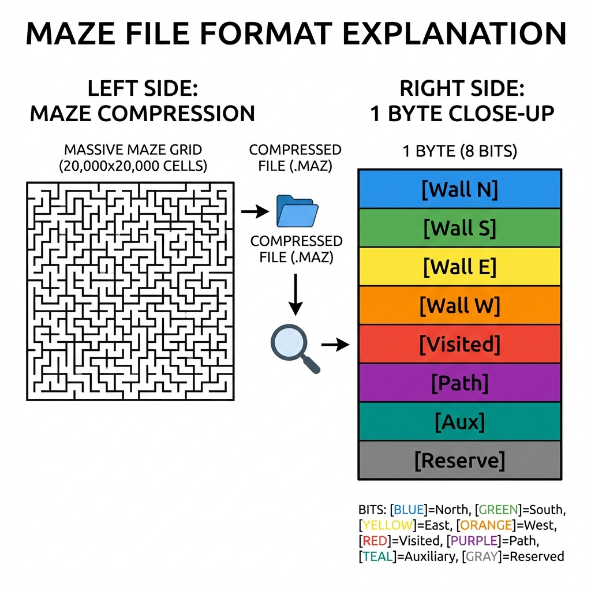

### 1. Bit-Packing (The "Semi-Efficient" Byte)
Instead of storing "Wall" or "Empty" (1 bit), we store **8 Flags** per cell in a single byte. This allows solvers to mark visited states without allocating new memory.

**Example: 4 Cells in a Row**
Imagine 4 cells. Some are walls, some are paths.
*   **Cell 0**: `00001001` (Walls: N, W)
*   **Cell 1**: `00000011` (Walls: N, S)
*   **Cell 2**: `00100000` (Bit 5: Visited by Solver)
*   **Cell 3**: `00000000` (Empty / Open)

This density allows a **20,000 x 20,000** maze (400 Million Cells) to fit in ~400MB RAM.

### 3. Compression Magic (File Size)
Because mazes have repeating patterns (long corridors), we use **ZLIB** to crush the data.

**Size Comparison (5000x5000 Maze)**
| Format | Size | Description |
| :--- | :--- | :--- |
| **Naive Text (JSON)** | ~450 MB | Storing `[0, 1, 0, ...]` as text. |
| **Raw Binary** | 25 MB | Exact 1 byte per cell. |
| **Compressed .maze** | **~4 MB** | ZLIB collapses patterns (85% Savings). |
| **Seed Only** | < 1 KB | Infinite efficiency, but requires re-generation. |

**Real-World Scale (20,000 x 20,000)**
*   **Total Cells**: 400,000,000
*   **File Size**: **381 MB** (400,000,049 bytes)
*   **Efficiency**: Nearly perfect 1-byte-per-cell mapping.

---

## 📐 Algorithm Logic & Theory

Why do they look different? Here is the Computer Science behind the 4 generators.

### 1. Recursive Backtracker ("DFS")
**The River Maker**.

*   **Logic**: Uses a **Stack** (LIFO). It pushes forward as far as possible, like a river carving a canyon. When it hits a dead end, it retreats (backtracks) until it finds a new opening.
*   **Result**: Extremely long, winding singular paths. Low branching factor.
*   **Hardware**: **CPU** (Inherently serial).

```mermaid
graph TD
    A[Start] --> B{Can Move?}
    B -- Yes --> C[Carve & Push to Stack]
    C --> B
    B -- No --> D[Pop Stack (Backtrack)]
    D --> B
```

### 2. Prim's Algorithm
**The Spreading Tree**.
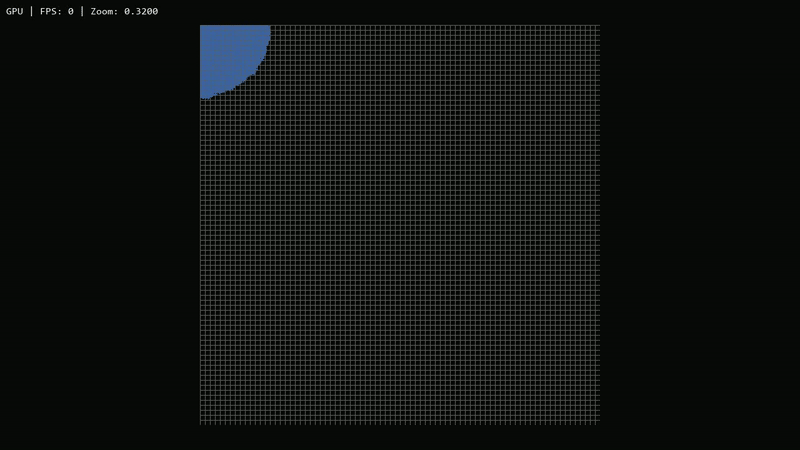
*   **Logic**: Uses a **Set** of "Frontier" cells. It picks a random cell from the active edge of the maze and expands it.
*   **Result**: Short, spiky branches. Very balanced but lacks long corridors.
*   **Hardware**: **CPU**.

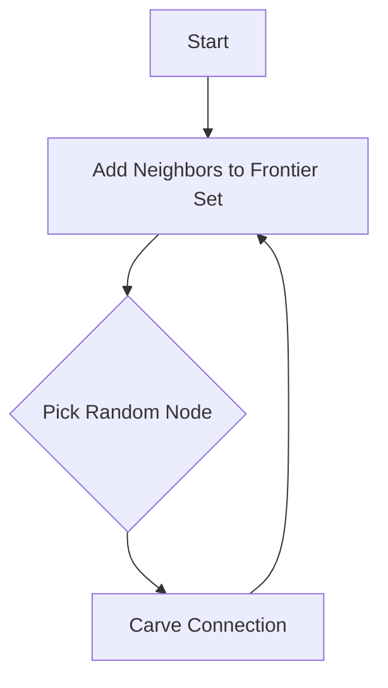

### 3. Fractal (Taichi)
**The Divide & Conquer**.
*   **How it Works**: The algorithm cheats time by splitting the work.
    1.  **Macro Step**: CPU generates a tiny "Maze of Blocks" (e.g., 100x100 blocks).
    2.  **Micro Step**: GPU launches 10,000 threads. Each thread generates a 32x32 maze inside its own private block.
    3.  **Stitch Step**: GPU opens specific holes between blocks based on the Macro Maze.
*   **Why it looks Blocky**: You can visibly see the "seams" where blocks connect, creating a distinct "super-structure".

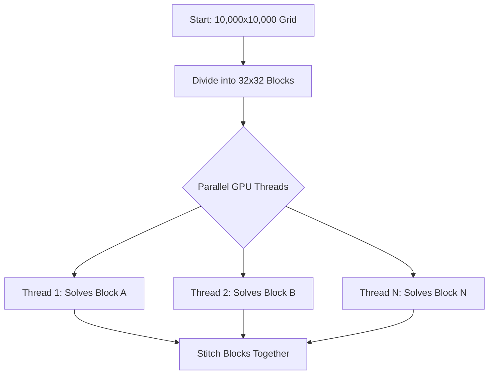

### 4. Organic (Taichi)
**The Coral**.
*   **How it Works**: Instead of one builder, we have thousands.
    1.  **Spawn**: Droves 10,000 "Walkers" at random points.
    2.  **Walk**: Each walker moves randomly, carving path.
    3.  **Collision**: If a walker hits a visited cell, it dies (stops).
    4.  **Respawn**: Dead walkers respawn at new unvisited locations.
*   **Why it looks Organic**: The multiple agents colliding create a "fuzzy", chaotic texture with high branching and no long straight lines.

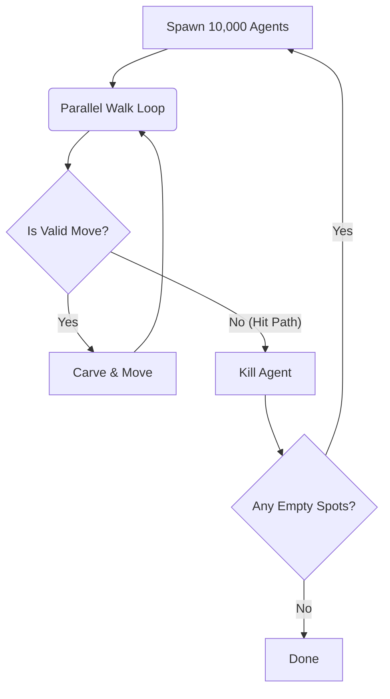

## 🏗️ Project Structure

```bash
Maze_Counter/
├── benchmarks/         # Performance data and graphs
├── docs/               # Documentation images and assets
├── maze_engine/        # Core source code
│   ├── algo/           # Generator & Solver algorithms
│   ├── core/           # Grid, Bitwise Logic, Complexity
│   ├── io/             # Binary Serialization (Save/Load)
│   ├── viz/            # Pygame & Taichi Renderers
│   └── main.py         # CLI Entrypoint
├── recordings/         # Output videos
├── scripts/            # Analysis tools
│   ├── benchmark_suite.py
│   ├── comp_benchmark.py
│   ├── scale_comparison.py
│   └── solver_benchmark.py
├── tests/              # Unit & Integration Tests ("pytest")
│   ├── conftest.py
│   ├── test_algo.py
│   ├── test_complexity.py
│   ├── test_gpu.py
│   ├── test_grid.py
│   ├── test_io.py
│   └── test_solver.py
├── README.md           # You are here
└── requirements.txt    # Project dependencies
```

## 🎮 Controls (Visual Mode)
- **Mouse Wheel**: Zoom In / Out (Infinite scaling)
- **Left/Right Click + Drag**: Pan the camera


